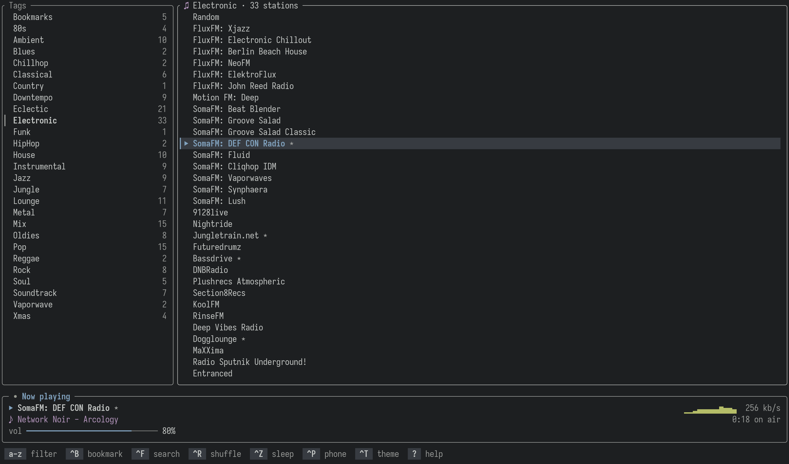

# goradion
Goradion is a TUI online radio player.

You can listen to a curated list of stations or search for more online via radio-browser.info.

<p align="center">
  
</p>


## Install
[Download goradion](https://github.com/agejevasv/goradion/releases/latest) for Linux, macOS or
Windows.

### Build from source
You need [Rust](https://rustup.rs) 1.88 or newer, and on Linux the ALSA headers and pkg-config
(`apt install libasound2-dev pkg-config`, `dnf install alsa-lib-devel`, `pacman -S alsa-lib`):
```bash
cargo install --locked --git https://github.com/agejevasv/goradion
```
Or in a clone, `cargo build --release` leaves the binary in `target/release/`.

## Run
On Windows just double click the downloaded exe (or run it from cmd to use flags), on other OSes:
```bash
goradion          # the built-in stations
goradion -s FILE  # your own stations, see below
```
Press `?` for the keys. The other flags:

| Flag | |
|------|---|
| `-r [key]`, `-p port` | the [phone remote](#remote-control) |
| `-c` | check that every station plays, then quit |
| `-d` | debug log, in `goradion.log` in the current directory |
| `-v` | show the version |
| `--ascii` | ASCII instead of Unicode symbols |
| `--no-vu` | no spectrum meter |

## Stations
The stations are configured using a CSV file with a title, URL and semicolon `;` separated tag(s), e.g.:

```csv
Title,URL,tag_1[;...;tag_n]
...
```
Stations file can be passed with `-s` argument; goradion supports both local files and HTTP URLs, e.g.:
```bash
goradion -s /path/to/stations.csv

OR

goradion -s https://path-to/stations.csv
```

## Remote control
Press `Ctrl+P` to control goradion from a phone. It starts a small web server on all
interfaces and shows a QR code, the address and a 6-character access code. Scan the QR
code with the phone camera, or open the address in the phone browser and type the code.
The phone has to be on the same network as the computer.

The page has the same tags, station lists, search, volume and shuffle controls as the
TUI. Whatever you tap on the phone is reflected in the TUI and vice versa.

The code changes every time goradion starts, so knowing the IP alone is not enough to
control the player; the phone asks for the new code when it changes. Press `Ctrl+P`
again at any time to see the QR code and the code again. The server is shut down when
goradion exits.

The server prefers port `7373` and falls back to a free port if it is taken; choose a
different preferred port with `-p`:
```bash
goradion -p 8080
```

Start the server together with goradion with `-r`. It takes an optional access code of
any length; `""` turns the code off, so anyone on the network can control the player:
```bash
goradion -r                  # random code, as with Ctrl+P
goradion -r "my secret code" # a fixed code, handy for a bookmarked phone
goradion -r ""               # no code
```

To start it every time, or to keep the port and code, use the `remote` section of the
[config](#config).

## Themes
Press `Ctrl+T` to pick a colour theme. It is saved in the [config](#config).

## Config
goradion creates `config.yaml` on the first run, in `~/.config/goradion`
(`~/Library/Application Support/goradion` on Mac, `%APPDATA%\goradion` on Windows):

```yaml
theme: terminal         # Ctrl+T saves it here
autoplay: true          # play the last station at launch; false only selects it

volume: 80              # remembered from the last run
tag: Jazz
station: https://...

remote:                 # the phone remote, Ctrl+P
  autostart: false      # start it with goradion, like -r
  port: 7373            # preferred port, like -p
  key: my secret code   # a fixed access code; "" for none; leave out for a random one per run
```

Command-line flags win over the file. goradion writes only `volume`, `tag` and `station`
when it quits, and `theme` when you pick one with `Ctrl+T`. Everything else, including
edits made while it runs, is left as you wrote it.
